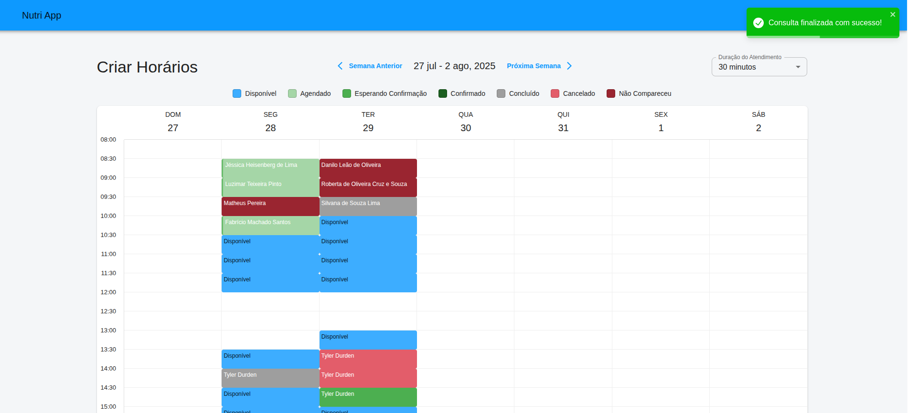
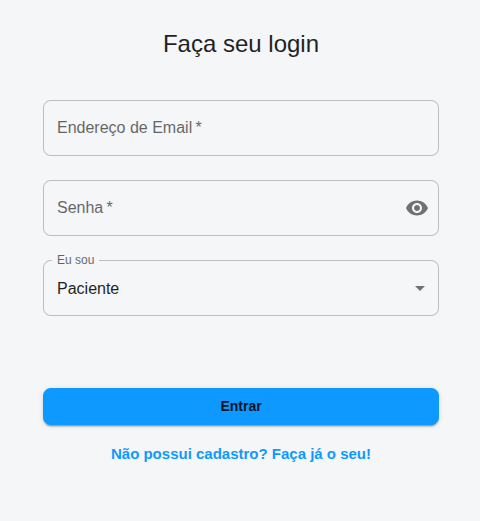
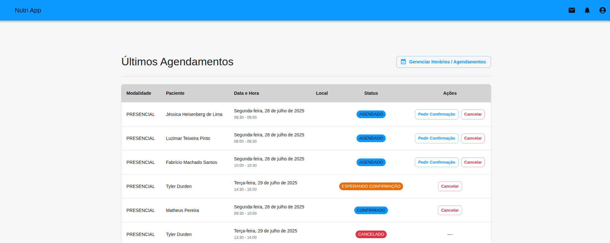
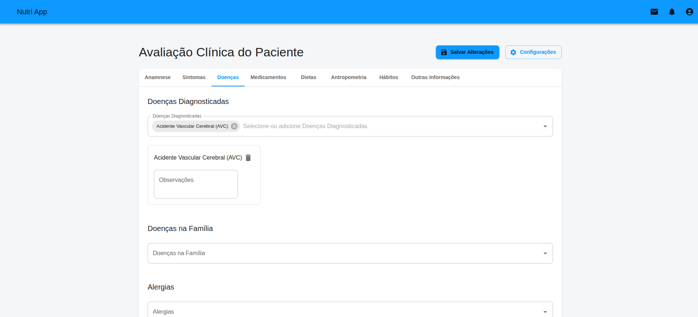

# NutriApp 🍏

## A ponte direta para uma vida mais saudável.

**NutriApp** é uma plataforma inovadora que revoluciona a interação entre nutricionistas e pacientes, eliminando barreiras e fortalecendo o vínculo terapêutico. Nossa missão é remover a necessidade de intermediários, como secretárias, para criar um canal de comunicação direto, ágil e focado no que realmente importa: **a sua jornada de bem-estar.**

Para o paciente, oferecemos autonomia e acesso sem precedentes. Para o nutricionista, proporcionamos uma ferramenta poderosa de gestão e um contato mais próximo e humanizado com quem confia em seu trabalho.

---

### ✨ Principais Funcionalidades

#### Para Pacientes 🙋‍♀️🙋‍♂️

Capacitamos você a tomar o controle da sua saúde com ferramentas intuitivas e acesso direto ao seu nutricionista.

- 🗓️ **Agenda na Palma da Mão:** Marque, remarque ou visualize suas consultas com total autonomia, 24 horas por dia, sem telefonemas ou espera.
- 📊 **Seu Progresso, Sempre com Você:** Tenha acesso instantâneo a todo o seu histórico, planos alimentares, avaliações antropométricas e metas, diretamente no app.
- 🔔 **Notificações Inteligentes:** Receba lembretes de consultas, confirmações e novas mensagens do seu nutricionista em tempo real.
- 📄 **Documentos Organizados:** Exporte seus planos e avaliações em formato PDF com um único clique, perfeito para imprimir ou compartilhar.
- 💬 **Comunicação Simplificada:** Um canal direto para tirar dúvidas e manter o contato com seu profissional de saúde.

#### Para Nutricionistas 👨‍⚕️👩‍⚕️

Otimize sua rotina, fidelize seus pacientes e eleve o nível do seu atendimento, sem a necessidade de uma secretária.

- 📅 **Gestão de Agenda Inteligente:** Organize seus horários de forma flexível, gerencie múltiplos locais de atendimento e tenha uma visão clara da sua semana de trabalho.
- 👥 **Contato Próximo e Contínuo:** Fortaleça o vínculo terapêutico com seus pacientes, oferecendo um acompanhamento mais presente e eficaz.
- 🔔 **Notificações em Tempo Real:** Seja avisado instantaneamente quando um paciente marcar, cancelar ou confirmar uma consulta, mantendo você sempre no controle.
- 📈 **Anamnese Digital e Completa:** Crie e gerencie fichas de avaliação detalhadas, com campos normalizados e a possibilidade de adicionar campos personalizados para um atendimento único.
- ✍️ **Planos Alimentares Digitais:** Elabore e envie os planos alimentares diretamente pela plataforma, com a opção de exportar em PDF para o paciente.
- 🔍 **Busca e Gestão de Pacientes:** Encontre facilmente qualquer paciente em sua base, visualize o histórico e a data da última consulta com agilidade.

---

### 🚀 Tecnologias Utilizadas

Este projeto foi construído com as tecnologias mais modernas e robustas do mercado, garantindo performance, segurança e escalabilidade.

- **Backend:**
  - Java 21
  - Spring Boot 3
  - Spring Security & JWT
  - JPA / Hibernate
  - PostgreSQL
  - WebSockets (para notificações em tempo real)
  - Maven

- **Frontend:**
  - React
  - TypeScript
  - Redux Toolkit
  - Material-UI (MUI)
  - Vite
  - Axios

---

### 🛠️ Como Executar o Projeto (Exemplo)

Para configurar o ambiente de desenvolvimento local, siga os passos abaixo:

1.  **Clone o repositório:**
    ```bash
    git clone [https://github.com/seu-usuario/nutriApp.git](https://github.com/seu-usuario/nutriApp.git)
    ```
2.  **Configure o Backend:**
    - Navegue até a pasta `backend`.
    - Configure suas variáveis de ambiente (`.env`) com as credenciais do banco de dados.
    - Execute o projeto: `mvn spring-boot:run`
3.  **Configure o Frontend:**
    - Navegue até a pasta `frontend`.
    - Instale as dependências: `npm install`
    - Inicie o servidor de desenvolvimento: `npm run dev`

---

### 🎨 Visualização

|                      Agenda                      |
| :----------------------------------------------: |
|  |

|                      Login                      |
| :---------------------------------------------: |
|  |

|                  Últimos Agendamentos                  |
| :----------------------------------------------------: |
|  |

|                 Avaliação Clínica                 |
| :-----------------------------------------------: |
|  |

|                     Dashboard                     |
| :-----------------------------------------------: |
|  |

---

### 🤝 Como Contribuir

Contribuições são o que tornam a comunidade open-source um lugar incrível para aprender, inspirar e criar. Qualquer contribuição que você fizer será **muito bem-vinda**.

1.  Faça um Fork do projeto
2.  Crie sua Feature Branch (`git checkout -b feature/AmazingFeature`)
3.  Faça o Commit das suas alterações (`git commit -m 'Add some AmazingFeature'`)
4.  Faça o Push para a Branch (`git push origin feature/AmazingFeature`)
5.  Abra um Pull Request

---

### 📄 Licença

Distribuído sob a licença MIT. Veja `LICENSE` para mais informações.
